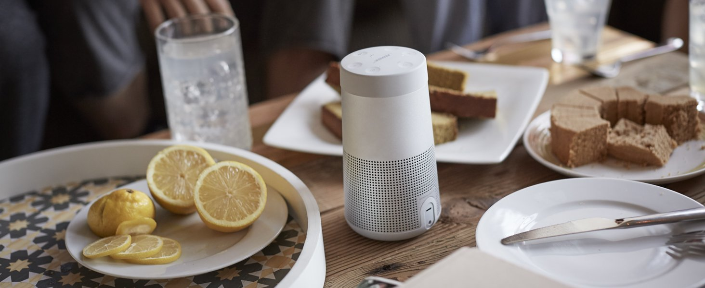

# Bose Store UI

Bose Store UI is HTML, CSS and Javascript implementation of UI provided by UX team design. In this project also included SASS implementation for CSS.

# Use

There's two main components you can use:

#### Card
You can use card component alone like below:
```html
<div class="my-card">
    <div class="my-card__head">
      <div class="my-card__tag">BESTSELLER</div>
      
    </div>
    <div class="my-card__body">
      <div class="my-card__title">Bose SoundLink</div>
      <div class="my-card__description">Little speaker. Big goosebumps.</div>
    </div>
    <div class="my-card__foot">
      <div class="my-card__action">
        <div class="my-card__action__button my-card__action__icon my-popover-toggle" data-target="popover1"><i class="icon-quicklook"></i></div>
        <div class="my-card__action__button my-card__action__price">$ 199</div>
      </div>
    </div>
</div>
```
Or you can use my-card__container to show multiple card with horizontal view. Use class space to add space between card.
```html
<div class="my-card__container">
    <div class="my-card space"> ... </div>
    <div class="my-card space"> ... </div>
    <div class="my-card space"> ... </div>
</div>
```
#### Pop Over
You can use Pop Over component like below:
```html
<div id="popover1" class="my-popover hide">
    <div class="my-popover__container">
      <div class="my-popover__inner my-popover__inner--left">
        <div class="my-popover__tag">
          BESTSELLER
        </div>
        <div class="my-popover__carousel">
          
          
          
        </div>
        <div class="my-popover__carousel-navigation">
          <div class="my-popover__carousel__dots">
            <div class="my-popover__carousel__dotclick active my-popover__carousel__dot my-carousel-toggle" data-target="carouselImage1"><span class="my-popover__carousel__dot__inner"></span></div>
            <div class="my-popover__carousel__dotclick my-popover__carousel__dot my-carousel-toggle" data-target="carouselImage2"><span class="my-popover__carousel__dot__inner"></span></div>
            <div class="my-popover__carousel__dotclick my-popover__carousel__dot my-carousel-toggle" data-target="carouselImage3"><span class="my-popover__carousel__dot__inner"></span></div>
          </div>
        </div>
      </div>
      <div class="my-popover__inner my-popover__inner--right">
        <div class="my-popover__head">
          <div class="my-popover__title">
            Bose SoundLink
          </div>
          <div class="my-popover__price">
            $ 199
          </div>
          <div class="my-popover__description">
            Wireless earphones for music lovers who live to move.
          </div>
        </div>
        <div class="my-popover__body">
          <div class="my-popover__tab">
            <div class="my-popover__tab__label">
              <div class="my-popover__tab__label__item active my-tab-toggle" data-target="tabcontent1">
                Specification
              </div>
              <div class="my-popover__tab__label__item my-tab-toggle" data-target="tabcontent2">
                Features
              </div>
            </div>
            <div class="my-popover__tab__content">
              <div id="tabcontent1" class="my-popover__tab__content__item active my-tab">
                <div class="my-popover__list">
                  <div class="my-popover__list__item">
                    <i class="icon-check"></i> <span class="my-popover__list__item__text">Up to 8 hours playtime</span>
                  </div>
                  <div class="my-popover__list__item">
                    <i class="icon-check"></i> <span class="my-popover__list__item__text">Powerfull sound</span>
                  </div>
                  <div class="my-popover__list__item">
                    <i class="icon-check"></i> <span class="my-popover__list__item__text">Wireless earphones</span>
                  </div>
                </div>
              </div>

              <div id="tabcontent2" class="my-popover__tab__content__item my-tab">
                <div class="my-popover__list">
                  <div class="my-popover__list__item">
                    <i class="icon-check"></i> <span class="my-popover__list__item__text">Bumpers for bumping</span>
                  </div>
                  <div class="my-popover__list__item">
                    <i class="icon-check"></i> <span class="my-popover__list__item__text">All sound. No seam.</span>
                  </div>
                  <div class="my-popover__list__item">
                    <i class="icon-check"></i> <span class="my-popover__list__item__text">Grab and go.</span>
                  </div>
                </div>
              </div>
            </div>
          </div>

          <div class="my-popover__colorpick">
            <div class="my-popover__colorpick__label">
              Choose your colors
            </div>
            <form class="my-popover__colorpick__form">
              <input class="my-radio grey" type="radio" name="colorpick" value="grey" checked>
              <input class="my-radio black" type="radio" name="colorpick" value="black">
              <input class="my-radio gold" type="radio" name="colorpick" value="gold">
            </form>
          </div>

          <div class="my-list">
            <div class="my-list__item">
              <i class="icon-check"></i> <span class="my-list__item__text">Free shipping & returns + 2 years warranty</span>
            </div>
          </div>
        </div>
        <div class="my-popover__foot">
          <div class="my-popover__action">
            <div class="my-popover__action__button my-popover__action__icon">
              <i class="icon-cart"></i>
            </div>
            <div class="my-popover__action__button my-popover__action__label">
              BUY NOW
            </div>
          </div>
        </div>
      </div>
    </div>
</div>
```
##### Pop Over Configuration

###### Carousel
Foreach carousel image you must use id(`carouselID`) for identifier, then you can create it toggle by adding class `my-carousel-toggle` on `carousel-navigation` (or any component you desire). Then add those id(`carouselID`) into attribute `data-target` on component so it can rever which image carousel you want to show.
```html
<div class="my-popover__carousel">
  
</div>
<div class="my-popover__carousel-navigation">
  <div class="my-popover__carousel__dots">
    <div class="my-popover__carousel__dotclick active my-popover__carousel__dot my-carousel-toggle" data-target={{carouselID}}>
        <span class="my-popover__carousel__dot__inner"></span>
    </div>
  </div>
</div>
```
###### Tab
Foreach tab you must use id(`tabID`) for identifier, then you can create it toggle by adding class `my-tab-toggle` on  (or any component you desire). Then add those id(`tabID`) into attribute `data-target` on component so it can rever which tab content you want to show.
```html
<div class="my-popover__tab">
    <div class="my-popover__tab__label">
      <div class="my-popover__tab__label__item active my-tab-toggle" data-target={{tabID}}>
        Title
      </div>
    </div>
    <div class="my-popover__tab__content">
      <div id={{tabID}} class="my-popover__tab__content__item active my-tab">
        <div class="my-popover__list">
          <div class="my-popover__list__item">
            <i class="icon-check"></i> <span class="my-popover__list__item__text">Up to 8 hours playtime</span>
          </div>
          <div class="my-popover__list__item">
            <i class="icon-check"></i> <span class="my-popover__list__item__text">Powerfull sound</span>
          </div>
          <div class="my-popover__list__item">
            <i class="icon-check"></i> <span class="my-popover__list__item__text">Wireless earphones</span>
          </div>
        </div>
      </div>
    </div>
</div>
```

# Use on Component Based
To use this on component based, you need to control and manage state by yourself. In many case you can see how 'active' class is responsible to show and hide a component, you can use it as a state.

# Assumptions
 - Javascript only use to show interaction, to create component-state-base, you need to implement the javascript to manage it state.
